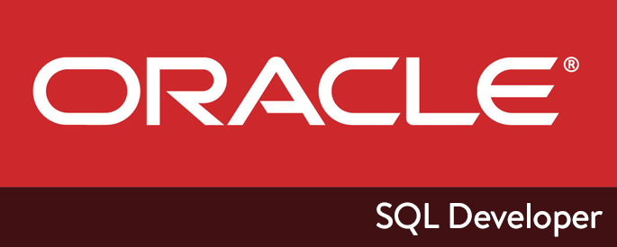

# List of SQL commands for SQL Developer

> _Credits to the image creator_

## List of Contents
- **Questions**
    - [what is this and its purpose?](#what-is-this-and-its-purpose)
    - [How is the repository structured?](list/Sections)
    - [Other questions](docs)

- **Sections**
    - [Commands](List/Commands.md)
    - [Documents](list/documents)
    - [Exercises](list/exercises)

## What is this and its purpose?
This is a repository in which I store the knowledge that I have acquired during my studies at the university or in my spare time.

Its purpose is to aid my own learning and retention, while also serving as a resource for individuals beginning their journey as SQL Developers.

## Repository in progress

This repository is still in progress, so it is possible that some sections are not yet available.